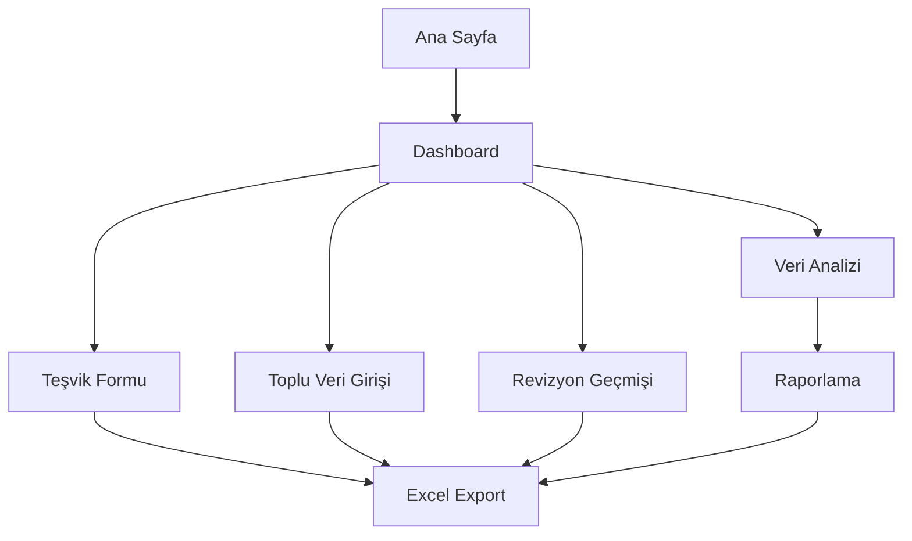

# Excel Benzeri Özellikler Geliştirme Planı

## 1. Proje Genel Bakış
Mevcut teşvik yönetim sistemine Excel benzeri gelişmiş özellikler eklenerek kullanıcı deneyimini iyileştirme ve veri yönetim kapasitesini artırma projesi.

## 2. Temel Özellikler

### 2.1 Kullanıcı Rolleri
| Rol | Kayıt Yöntemi | Temel Yetkiler |
|-----|---------------|----------------|
| Sistem Yöneticisi | Admin paneli | Tüm özelliklere erişim, sistem yönetimi |
| Proje Yöneticisi | Yönetici onayı | Teşvik oluşturma, düzenleme, raporlama |
| Veri Girişçisi | Standart kayıt | Veri girişi, görüntüleme |
| Görüntüleyici | Misafir erişimi | Sadece okuma yetkisi |

### 2.2 Özellik Modülleri
Sistem gereksinimleri aşağıdaki ana sayfalardan oluşmaktadır:

1. **Excel Export Modülü**: Renk kodlamalı PDF/Excel çıktı sistemi, tablo formatında export
2. **Revizyon Görselleştirme Sayfası**: Alt alta revizyon kayıtları, değişiklik renk kodlaması
3. **Toplu Veri Girişi Sayfası**: Kopyala-yapıştır özelliği, Excel benzeri hızlı veri girişi
4. **Dashboard & Raporlama Sayfası**: Özet tablolar, grafik ve chart görünümleri
5. **Gelişmiş Teşvik Formu**: Mevcut form üzerinde Excel benzeri özellikler
6. **Veri Analiz Sayfası**: İstatistiksel analizler ve karşılaştırmalar
7. **Export Yönetim Sayfası**: Çıktı formatları ve şablonları yönetimi

### 2.3 Sayfa Detayları

| Sayfa Adı | Modül Adı | Özellik Açıklaması |
|-----------|-----------|--------------------|
| Excel Export Modülü | PDF Export | Excel benzeri tablo formatında PDF oluşturma, renk kodlamalı çıktı sistemi |
| Excel Export Modülü | Excel Export | Orijinal Excel formatında export, formül ve renk koruması |
| Excel Export Modülü | Şablon Yönetimi | Özelleştirilebilir export şablonları, logo ve başlık ekleme |
| Revizyon Görselleştirme | Revizyon Timeline | Alt alta revizyon kayıtları görünümü, zaman çizelgesi |
| Revizyon Görselleştirme | Değişiklik Karşılaştırma | Eski-yeni değer karşılaştırması, renk kodlamalı farklar |
| Revizyon Görselleştirme | Revizyon Filtreleme | Tarih, kullanıcı, alan bazında filtreleme |
| Toplu Veri Girişi | Kopyala-Yapıştır | Excel'den direkt veri aktarımı, format doğrulama |
| Toplu Veri Girişi | Hızlı Veri Girişi | Klavye kısayolları, otomatik tamamlama |
| Toplu Veri Girişi | Veri Doğrulama | Gerçek zamanlı veri kontrolü, hata bildirimi |
| Dashboard & Raporlama | Özet Tablolar | Excel benzeri pivot tablolar, dinamik özetler |
| Dashboard & Raporlama | Grafik Görünümleri | Chart.js ile interaktif grafikler, drill-down |
| Dashboard & Raporlama | KPI Göstergeleri | Anahtar performans göstergeleri, trend analizleri |
| Gelişmiş Teşvik Formu | Excel Benzeri Grid | Tablo görünümü, satır-sütun navigasyonu |
| Gelişmiş Teşvik Formu | Formül Desteği | Otomatik hesaplamalar, Excel benzeri formüller |
| Veri Analiz Sayfası | İstatistiksel Analiz | Ortalama, toplam, yüzde hesaplamaları |
| Veri Analiz Sayfası | Karşılaştırma Araçları | Dönemsel karşılaştırmalar, trend analizleri |
| Export Yönetim Sayfası | Format Yönetimi | PDF, Excel, CSV format seçenekleri |
| Export Yönetim Sayfası | Şablon Editörü | Drag-drop şablon tasarımcısı |

## 3. Temel İş Akışı

**Ana Kullanıcı Akışı:**
1. Kullanıcı sisteme giriş yapar
2. Dashboard'da genel durumu görüntüler
3. Teşvik formunu Excel benzeri arayüzle doldurur
4. Toplu veri girişi ile hızlı veri aktarımı yapar
5. Revizyon geçmişini görselleştirilmiş formatta inceler
6. Excel/PDF formatında renk kodlamalı rapor alır

**Yönetici Akışı:**
1. Admin paneline erişir
2. Dashboard'da KPI'ları ve trendleri analiz eder
3. Gelişmiş raporlama araçlarını kullanır
4. Export şablonlarını yönetir
5. Sistem geneli istatistikleri görüntüler

## 4. Kullanıcı Arayüzü Tasarımı

### 4.1 Tasarım Stili
- **Ana Renkler**: Excel benzeri yeşil (#217346), mavi (#1976d2), gri tonları
- **Buton Stili**: Material Design 3D butonlar, hover efektleri
- **Font**: Roboto 14px ana metin, 16px başlıklar, monospace kodlar için
- **Layout Stili**: Grid tabanlı, responsive tasarım, Excel benzeri tablo görünümü
- **İkon Stili**: Material Icons, Excel benzeri toolbar ikonları

### 4.2 Sayfa Tasarım Genel Bakışı

| Sayfa Adı | Modül Adı | UI Elementleri |
|-----------|-----------|----------------|
| Excel Export Modülü | Export Toolbar | Butonlar: PDF, Excel, Şablon seç, Renk kodları toggle, Önizleme |
| Excel Export Modülü | Önizleme Alanı | Tablo görünümü, renk kodlamalı hücreler, sayfa düzeni |
| Revizyon Görselleştirme | Timeline Görünümü | Dikey zaman çizelgesi, renk kodlamalı değişiklikler, expand/collapse |
| Revizyon Görselleştirme | Karşılaştırma Paneli | Yan yana eski-yeni değer gösterimi, highlight farklar |
| Toplu Veri Girişi | Excel Benzeri Grid | Spreadsheet görünümü, satır-sütun başlıkları, hücre editörü |
| Toplu Veri Girişi | Import Toolbar | Dosya seç, kopyala-yapıştır alanı, doğrulama sonuçları |
| Dashboard & Raporlama | KPI Kartları | Metric kartları, trend ok işaretleri, renk kodlamalı durumlar |
| Dashboard & Raporlama | Chart Alanı | Interaktif grafikler, legend, zoom/pan özellikler |

### 4.3 Responsive Tasarım
Masaüstü öncelikli tasarım, tablet ve mobil uyumlu grid sistemi, touch optimizasyonu.

## 4. Teknik Gereksinimler

### 4.1 Frontend Teknolojileri
- React.js (mevcut)
- Material-UI (mevcut)
- Chart.js/Recharts (grafik için)
- react-data-grid (Excel benzeri grid)
- jsPDF (PDF export)
- xlsx (Excel export)
- react-timeline-range-slider (revizyon timeline)

### 4.2 Backend Geliştirmeleri
- Export API endpoints
- Revizyon tracking sistemi
- Bulk import/export servisleri
- Dashboard analytics API
- Template management API

### 4.3 Veritabanı Şeması
- Revision history tablosu
- Export templates tablosu
- Dashboard metrics tablosu
- Bulk operation logs tablosu

## 5. Geliştirme Aşamaları

### Aşama 1: Excel Export Modülü (1-2 hafta)
- PDF/Excel export API geliştirme
- Renk kodlamalı çıktı sistemi
- Export şablonları yönetimi

### Aşama 2: Revizyon Görselleştirme (1-2 hafta)
- Revizyon tracking sistemi
- Timeline görünümü
- Değişiklik karşılaştırma

### Aşama 3: Toplu Veri Girişi (1-2 hafta)
- Excel benzeri grid bileşeni
- Kopyala-yapıştır özelliği
- Veri doğrulama sistemi

### Aşama 4: Dashboard & Raporlama (2-3 hafta)
- KPI dashboard
- İnteraktif grafikler
- Gelişmiş filtreleme

### Aşama 5: Entegrasyon & Test (1 hafta)
- Tüm modüllerin entegrasyonu
- Performans optimizasyonu
- Kullanıcı testleri

## 6. Başarı Kriterleri

- Excel benzeri kullanıcı deneyimi sağlanması
- %50 daha hızlı veri girişi
- Renk kodlamalı export özelliği
- Revizyon geçmişi görselleştirme
- Dashboard ile anlık raporlama
- Responsive tasarım uyumluluğu