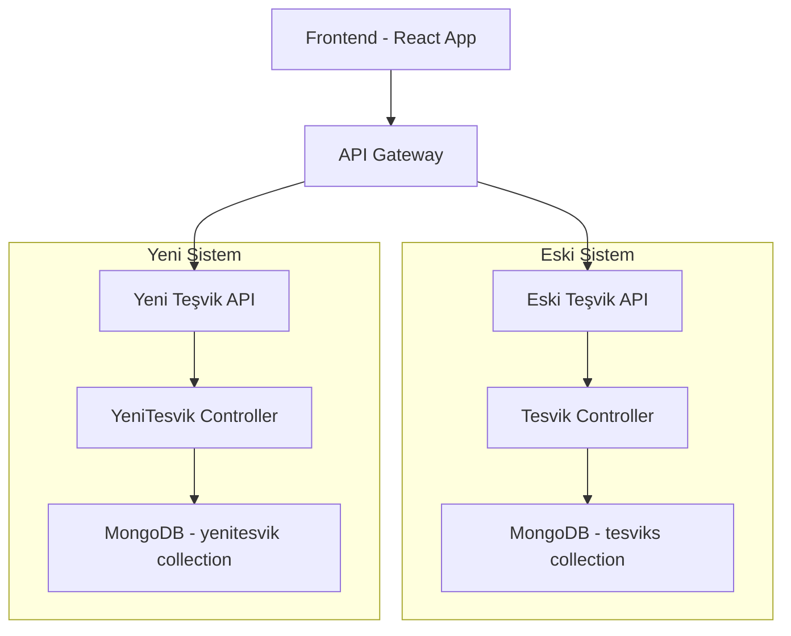
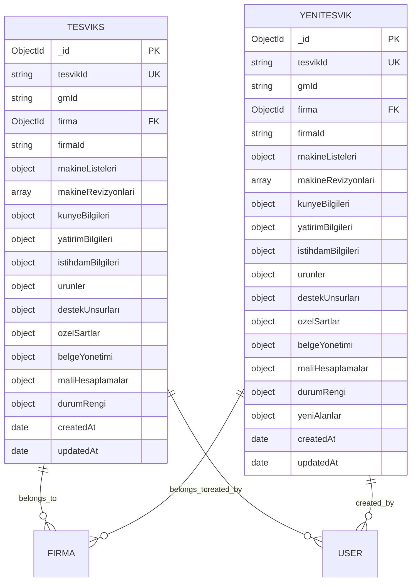

# Yeni Teşvik Sistemi - Teknik Mimari ve İmplementasyon Detayları

## 1. Teknik Mimari Tasarımı

### 1.1 Sistem Mimarisi



### 1.2 Teknoloji Stack'i

**Backend:**
- Node.js + Express.js
- MongoDB (ayrı collections)
- Mongoose ODM
- JWT Authentication
- Multer (file upload)
- XLSX (Excel işlemleri)
- PDFKit (PDF oluşturma)

**Frontend:**
- React 18
- Material-UI (MUI)
- React Router v6
- Axios (HTTP client)
- React Hook Form
- Chart.js (grafikler)

## 2. Veritabanı Tasarımı

### 2.1 Collection Yapısı



### 2.2 Index Stratejisi

**Eski Sistem (tesviks collection):**
```javascript
// Mevcut indexler korunur
db.tesviks.createIndex({ "tesvikId": 1 }, { unique: true })
db.tesviks.createIndex({ "gmId": 1 })
db.tesviks.createIndex({ "firma": 1 })
db.tesviks.createIndex({ "firmaId": 1 })
db.tesviks.createIndex({ "belgeYonetimi.belgeDurumu": 1 })
```

**Yeni Sistem (yenitesvik collection):**
```javascript
// Yeni indexler
db.yenitesvik.createIndex({ "tesvikId": 1 }, { unique: true })
db.yenitesvik.createIndex({ "gmId": 1 })
db.yenitesvik.createIndex({ "firma": 1 })
db.yenitesvik.createIndex({ "firmaId": 1 })
db.yenitesvik.createIndex({ "belgeYonetimi.belgeDurumu": 1 })
db.yenitesvik.createIndex({ "yeniAlanlar.guncellemeTarihi": 1 })
```

## 3. API Tasarımı

### 3.1 Endpoint Yapısı

**Eski Sistem API:**
```
GET    /api/tesvik              - Teşvik listesi
POST   /api/tesvik              - Yeni teşvik
GET    /api/tesvik/:id          - Teşvik detayı
PUT    /api/tesvik/:id          - Teşvik güncelleme
DELETE /api/tesvik/:id          - Teşvik silme
```

**Yeni Sistem API:**
```
GET    /api/yeni-tesvik         - Yeni teşvik listesi
POST   /api/yeni-tesvik         - Yeni teşvik oluştur
GET    /api/yeni-tesvik/:id     - Yeni teşvik detayı
PUT    /api/yeni-tesvik/:id     - Yeni teşvik güncelle
DELETE /api/yeni-tesvik/:id     - Yeni teşvik sil
```

### 3.2 Request/Response Formatları

**Yeni Teşvik Oluşturma:**
```json
POST /api/yeni-tesvik
{
  "gmId": "YTS2024001",
  "firma": "ObjectId",
  "yatirimciUnvan": "Örnek Firma A.Ş.",
  "kunyeBilgileri": {
    "talepSonuc": "T",
    "revizeId": "REV001",
    "yatirimci": "12345678901",
    "yatirimciUnvan": "Örnek Firma A.Ş."
  },
  "yeniAlanlar": {
    "guncellemeTarihi": "2024-01-15",
    "yeniKategori": "Dijital Dönüşüm",
    "uygunlukKriteri": "Kritik Teknoloji"
  }
}
```

## 4. Frontend Bileşen Mimarisi

### 4.1 Sayfa Yapısı

```
src/pages/YeniTesvik/
├── YeniTesvikDashboard.js      - Ana kontrol paneli
├── YeniTesvikList.js           - Teşvik listesi
├── YeniTesvikForm.js           - Teşvik formu
├── YeniTesvikDetail.js         - Teşvik detayı
├── YeniMakineYonetimi.js       - Makine yönetimi
└── components/
    ├── YeniTesvikCard.js       - Teşvik kartı
    ├── YeniTesvikFilters.js    - Filtreleme
    ├── YeniMakineTable.js      - Makine tablosu
    └── YeniDurumBadge.js       - Durum göstergesi
```

### 4.2 State Yönetimi

**Context Yapısı:**
```javascript
// contexts/YeniTesvikContext.js
const YeniTesvikContext = createContext({
  tesvikler: [],
  selectedTesvik: null,
  filters: {},
  loading: false,
  error: null,
  // Actions
  fetchTesvikler: () => {},
  createTesvik: () => {},
  updateTesvik: () => {},
  deleteTesvik: () => {},
  setFilters: () => {}
});
```

### 4.3 Routing Yapısı

```javascript
// AppRouter.js güncellemesi
const AppRouter = () => {
  return (
    <Routes>
      {/* Eski Sistem Rotaları */}
      <Route path="/tesvik/*" element={<EskiTesvikRoutes />} />
      
      {/* Yeni Sistem Rotaları */}
      <Route path="/yeni-tesvik/*" element={<YeniTesvikRoutes />} />
    </Routes>
  );
};

// YeniTesvikRoutes.js
const YeniTesvikRoutes = () => {
  return (
    <Routes>
      <Route path="/" element={<YeniTesvikDashboard />} />
      <Route path="/liste" element={<YeniTesvikList />} />
      <Route path="/yeni" element={<YeniTesvikForm />} />
      <Route path="/:id" element={<YeniTesvikDetail />} />
      <Route path="/:id/duzenle" element={<YeniTesvikForm />} />
      <Route path="/makine" element={<YeniMakineYonetimi />} />
    </Routes>
  );
};
```

## 5. Veri Modeli Güncellemeleri

### 5.1 Yeni Alanlar

```javascript
// models/YeniTesvik.js - Ek alanlar
const yeniAlanlarSchema = new mongoose.Schema({
  // Devlet güncellemelerine uygun yeni alanlar
  guncellemeTarihi: { type: Date, default: Date.now },
  yeniKategori: {
    type: String,
    enum: ['Dijital Dönüşüm', 'Yeşil Teknoloji', 'Kritik Teknoloji', 'Stratejik Yatırım'],
    default: ''
  },
  uygunlukKriteri: {
    type: String,
    maxlength: 500
  },
  oncelikPuani: {
    type: Number,
    min: 0,
    max: 100,
    default: 0
  },
  dijitalDonusumOrani: {
    type: Number,
    min: 0,
    max: 100,
    default: 0
  },
  cevreselEtki: {
    karbonAyakIzi: { type: Number, default: 0 },
    enerjiVerimliligi: { type: Number, default: 0 },
    atikAzaltma: { type: Number, default: 0 }
  },
  yeniTesvikHesaplamalari: {
    dijitalBonusu: { type: Number, default: 0 },
    yesilBonusu: { type: Number, default: 0 },
    stratejikBonusu: { type: Number, default: 0 },
    toplamBonus: { type: Number, default: 0 }
  }
}, { _id: false });
```

### 5.2 Güncellenmiş İş Akışı

```javascript
// Yeni durum kodları
const yeniDurumKodlari = {
  'T': { renk: '#10b981', aciklama: 'Talep (Yeni Sistem)' },
  'O': { renk: '#3b82f6', aciklama: 'Onay (Yeni Sistem)' },
  'R': { renk: '#ef4444', aciklama: 'Red (Yeni Sistem)' },
  'G': { renk: '#f59e0b', aciklama: 'Güncelleme (Yeni Sistem)' },
  'S': { renk: '#6b7280', aciklama: 'Silme (Yeni Sistem)' },
  'D': { renk: '#8b5cf6', aciklama: 'Dijital Değerlendirme' },
  'Y': { renk: '#059669', aciklama: 'Yeşil Teknoloji Onayı' }
};
```

## 6. Güvenlik ve Yetkilendirme

### 6.1 Rol Tabanlı Erişim

```javascript
// middleware/yeniTesvikAuth.js
const yeniTesvikPermissions = {
  'admin': ['create', 'read', 'update', 'delete', 'approve'],
  'manager': ['create', 'read', 'update', 'submit'],
  'user': ['create', 'read', 'update'],
  'viewer': ['read']
};

const checkYeniTesvikPermission = (action) => {
  return (req, res, next) => {
    const userRole = req.user.rol;
    const permissions = yeniTesvikPermissions[userRole] || [];
    
    if (permissions.includes(action)) {
      next();
    } else {
      res.status(403).json({
        success: false,
        message: 'Yeni teşvik sistemi için yetkiniz bulunmamaktadır'
      });
    }
  };
};
```

### 6.2 Veri Güvenliği

```javascript
// Çapraz sistem veri erişimi engelleme
const preventCrossSystemAccess = (req, res, next) => {
  // Yeni teşvik API'sine gelen isteklerin sadece yenitesvik collection'ına erişmesini sağla
  req.systemType = 'yeni-tesvik';
  next();
};
```

## 7. Performans Optimizasyonları

### 7.1 Database Optimizasyonları

```javascript
// Aggregation pipeline optimizasyonları
const getYeniTesviklerOptimized = async (filters) => {
  const pipeline = [
    { $match: filters },
    { $lookup: {
        from: 'firmas',
        localField: 'firma',
        foreignField: '_id',
        as: 'firmaDetay'
    }},
    { $project: {
        tesvikId: 1,
        gmId: 1,
        yatirimciUnvan: 1,
        'belgeYonetimi.belgeDurumu': 1,
        'yeniAlanlar.yeniKategori': 1,
        'firmaDetay.tamUnvan': 1,
        createdAt: 1
    }},
    { $sort: { createdAt: -1 }},
    { $limit: 50 }
  ];
  
  return await YeniTesvik.aggregate(pipeline);
};
```

### 7.2 Frontend Optimizasyonları

```javascript
// React.memo ve useMemo kullanımı
const YeniTesvikCard = React.memo(({ tesvik, onEdit, onDelete }) => {
  const formattedDate = useMemo(() => {
    return new Date(tesvik.createdAt).toLocaleDateString('tr-TR');
  }, [tesvik.createdAt]);
  
  return (
    <Card>
      {/* Card content */}
    </Card>
  );
});

// Virtual scrolling için react-window
import { FixedSizeList as List } from 'react-window';

const YeniTesvikList = () => {
  const renderRow = ({ index, style }) => (
    <div style={style}>
      <YeniTesvikCard tesvik={tesvikler[index]} />
    </div>
  );
  
  return (
    <List
      height={600}
      itemCount={tesvikler.length}
      itemSize={120}
    >
      {renderRow}
    </List>
  );
};
```

## 8. Test Stratejisi

### 8.1 Backend Testleri

```javascript
// tests/yeniTesvik.test.js
describe('Yeni Teşvik API', () => {
  describe('POST /api/yeni-tesvik', () => {
    it('should create new tesvik with yeni alanlar', async () => {
      const tesvikData = {
        gmId: 'YTS2024001',
        firma: firmaMockId,
        yeniAlanlar: {
          yeniKategori: 'Dijital Dönüşüm',
          oncelikPuani: 85
        }
      };
      
      const response = await request(app)
        .post('/api/yeni-tesvik')
        .send(tesvikData)
        .expect(201);
        
      expect(response.body.data.yeniAlanlar.yeniKategori)
        .toBe('Dijital Dönüşüm');
    });
  });
  
  describe('Cross-system isolation', () => {
    it('should not access old tesvik data', async () => {
      // Yeni sistem API'sinin eski sistem verilerine erişemediğini test et
    });
  });
});
```

### 8.2 Frontend Testleri

```javascript
// tests/YeniTesvikForm.test.js
import { render, screen, fireEvent } from '@testing-library/react';
import YeniTesvikForm from '../pages/YeniTesvik/YeniTesvikForm';

describe('YeniTesvikForm', () => {
  it('should render yeni alanlar', () => {
    render(<YeniTesvikForm />);
    
    expect(screen.getByLabelText('Yeni Kategori')).toBeInTheDocument();
    expect(screen.getByLabelText('Öncelik Puanı')).toBeInTheDocument();
    expect(screen.getByLabelText('Dijital Dönüşüm Oranı')).toBeInTheDocument();
  });
  
  it('should calculate yeni teşvik bonusları', () => {
    // Yeni hesaplama mantığını test et
  });
});
```

## 9. Deployment ve DevOps

### 9.1 Environment Variables

```bash
# .env dosyasına eklenecek
YENI_TESVIK_DB_COLLECTION=yenitesvik
YENI_TESVIK_API_PREFIX=/api/yeni-tesvik
YENI_TESVIK_FEATURE_FLAG=true
```

### 9.2 Docker Configuration

```dockerfile
# Dockerfile güncellemesi
FROM node:18-alpine

WORKDIR /app

# Backend dependencies
COPY backend/package*.json ./backend/
RUN cd backend && npm ci --only=production

# Frontend dependencies  
COPY frontend/package*.json ./frontend/
RUN cd frontend && npm ci --only=production

# Copy source code
COPY backend ./backend
COPY frontend ./frontend

# Build frontend
RUN cd frontend && npm run build

# Expose ports
EXPOSE 5000 3000

# Start both systems
CMD ["npm", "run", "start"]
```

## 10. Monitoring ve Logging

### 10.1 Sistem Ayrımı

```javascript
// utils/logger.js
const createLogger = (system) => {
  return winston.createLogger({
    format: winston.format.combine(
      winston.format.timestamp(),
      winston.format.json(),
      winston.format.label({ label: system })
    ),
    transports: [
      new winston.transports.File({ 
        filename: `logs/${system}-error.log`, 
        level: 'error' 
      }),
      new winston.transports.File({ 
        filename: `logs/${system}-combined.log` 
      })
    ]
  });
};

const eskiTesvikLogger = createLogger('eski-tesvik');
const yeniTesvikLogger = createLogger('yeni-tesvik');
```

### 10.2 Metrics ve Analytics

```javascript
// middleware/metrics.js
const collectMetrics = (systemType) => {
  return (req, res, next) => {
    const startTime = Date.now();
    
    res.on('finish', () => {
      const duration = Date.now() - startTime;
      
      // Sistem bazlı metrik toplama
      metrics.increment(`${systemType}.requests.total`);
      metrics.histogram(`${systemType}.request.duration`, duration);
      metrics.increment(`${systemType}.response.${res.statusCode}`);
    });
    
    next();
  };
};
```

Bu teknik mimari ile iki sistem tamamen bağımsız çalışacak ve yeni sistem devlet güncellemelerine uygun olarak geliştirilecektir.